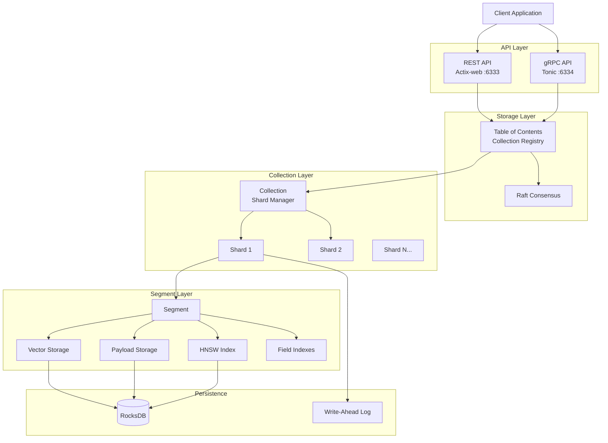
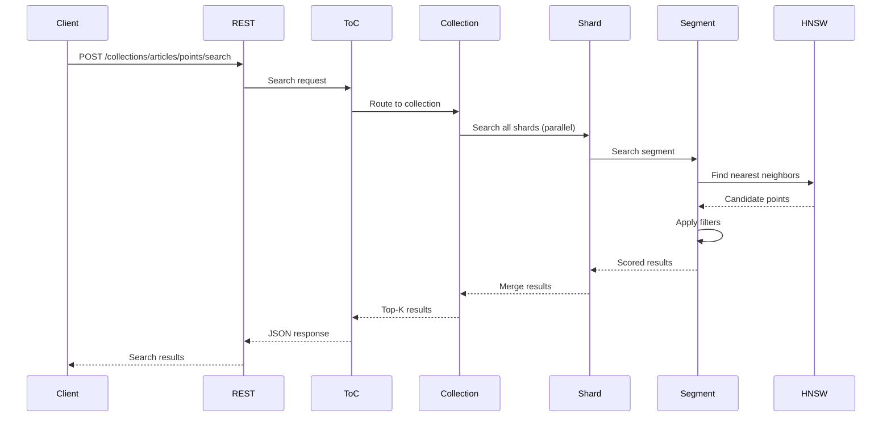
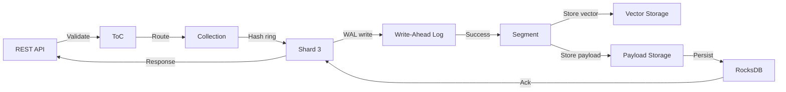

# Understanding Qdrant: Architecture and Core Concepts

**Series:** Qdrant Deep Dive (Post 1 of 7)
**Reading Time:** ~18 minutes
**Code Baseline:** Commit [`adcda004057df08389106da56f440db185f0c382`](https://github.com/qdrant/qdrant/commit/adcda004057df08389106da56f440db185f0c382)
**Prerequisites:** Basic understanding of vectors/embeddings, REST APIs

---

## What You'll Learn

- What problems Qdrant solves and why it exists
- High-level architecture from API to storage
- Core abstractions: Points, Collections, Segments, and Shards
- Why Rust, and what trade-offs were made
- How a search request flows through the system

---

## The Problem: Why Do We Need Vector Databases?

Imagine you're building a semantic search engine. You have millions of documents, each converted to a 384-dimensional vector by a transformer model like BERT. A user types a query, you convert it to a vector, and now you need to find the 10 most similar documents.

The naive approach? Compare your query vector to all millions of vectors. That's **O(N)** complexity—fine for thousands of vectors, catastrophic for millions.

This is where Qdrant comes in.

### What is Qdrant?

**Qdrant** (pronounced "quadrant") is a **vector similarity search engine** written in Rust. Think of it as:
- A database optimized for high-dimensional vectors
- A search engine that understands semantic similarity
- A distributed system that scales horizontally

### The Value Proposition

Traditional databases excel at exact matches ("Find user with ID=123"). But they struggle with:
- **Semantic search**: "Find documents about concepts similar to X"
- **Recommendation**: "Find products similar to what this user liked"
- **Anomaly detection**: "Find data points unlike the rest"
- **Image search**: "Find visually similar images"

Qdrant handles these by storing vectors alongside rich metadata, indexing them for fast approximate nearest neighbor (ANN) search, and providing production-grade features like replication, snapshots, and filtering.

---

## Architecture: The 30,000-Foot View

Let's start with the big picture:



### The Layers (Top to Bottom)

1. **API Layer**: HTTP and gRPC interfaces
2. **Storage Layer**: Collection management and consensus
3. **Collection Layer**: Sharding and distribution
4. **Segment Layer**: Vector storage and indexing
5. **Persistence**: RocksDB and WAL for durability

Each layer has clear responsibilities and boundaries. Let's dive into each.

---

## The Core Abstractions

### 1. Point: The Atomic Unit

A **Point** is the fundamental data structure in Qdrant:

```rust
// Conceptual representation from lib/segment/src/types.rs
pub struct Point {
    pub id: PointIdType,           // u64 or UUID
    pub vector: Vector,             // Dense or sparse vector
    pub payload: Payload,           // JSON metadata
}
```

**Example** (via REST API):
```json
{
  "id": 42,
  "vector": [0.1, 0.2, 0.3, ..., 0.5],  // 384 dimensions
  "payload": {
    "title": "Understanding Vector Databases",
    "author": "Jane Doe",
    "published": "2024-01-15",
    "tags": ["database", "ml"],
    "price": 19.99
  }
}
```

**Why this matters:** The payload lets you attach rich metadata. Later, you can search for "vectors similar to X **where** price < 50 **and** tags contain 'database'". This hybrid capability (vector similarity + structured filtering) is what makes Qdrant powerful.

### 2. Collection: A Named Set of Points

A **Collection** is like a table in a relational database, but for vectors.

**Creating a collection:**
```bash
curl -X PUT 'http://localhost:6333/collections/my_articles' \
  -H 'Content-Type: application/json' \
  -d '{
    "vectors": {
      "size": 384,
      "distance": "Cosine"
    }
  }'
```

**Key properties:**
- **Vector dimension**: Must be consistent (384 in this case)
- **Distance metric**: Cosine, Euclidean, Dot Product, etc.
- **Shard count**: How data is partitioned (default: auto)
- **Replication factor**: How many copies (default: 1)

Under the hood, a collection is **sharded**. More on that in a moment.

### 3. Segment: Immutable Storage Unit

A **Segment** is where vectors actually live. It's an immutable, self-contained unit containing:
- Vector data (dense, sparse, or quantized)
- Payload data (in-memory or on-disk)
- HNSW index (for fast search)
- Field indexes (for filtering)
- ID tracker (maps external IDs to internal offsets)

**Lifecycle:**
```
New writes → Mutable segment → Optimization → Immutable segment → Merge
```

**Location:** [`lib/segment/src/segment/mod.rs`](https://github.com/qdrant/qdrant/blob/adcda004057df08389106da56f440db185f0c382/lib/segment/src/segment/mod.rs)

**Why immutable?** Immutability enables:
- Lock-free concurrent reads
- Safe background optimization
- Easy snapshots
- Memory-mapped files

Segments are the performance workhorses. We'll explore them deeply in Post 2.

### 4. Shard: Distributed Partition

A **Shard** is a logical partition of a collection. If you have 10 million points and 5 shards, each shard contains ~2 million points.

**Types:**
- **Local shard**: Stored on this node (contains segments)
- **Remote shard**: Proxy to a shard on another node
- **Replica**: Copy of a shard for high availability

**Distribution strategy:** Hash ring (consistent hashing on point ID)

**Location:** [`lib/collection/src/shards/`](https://github.com/qdrant/qdrant/blob/adcda004057df08389106da56f440db185f0c382/lib/collection/src/shards/)

---

## How a Search Request Works

Let's trace a search query through the system:



### Step-by-Step

1. **Client sends search request** (REST POST or gRPC call)
   ```json
   {
     "vector": [0.2, 0.1, ...],
     "filter": {
       "must": [{"key": "price", "range": {"lt": 50}}]
     },
     "limit": 10
   }
   ```

2. **API layer validates** (vector dimension, request structure)

3. **Table of Contents (ToC) routes** to the collection
   - ToC is the registry of all collections
   - Location: [`lib/storage/src/content_manager/toc/mod.rs`](https://github.com/qdrant/qdrant/blob/adcda004057df08389106da56f440db185f0c382/lib/storage/src/content_manager/toc/mod.rs)

4. **Collection fans out** to all shards in parallel
   - Each shard searches its local segments
   - Distributed search if multi-node cluster

5. **Segment performs search:**
   - Query optimizer decides: HNSW vs full scan
   - If HNSW: Traverse graph to find nearest neighbors
   - Apply filters using field indexes
   - Score results

6. **Merge results** across shards
   - Take top-K from each shard
   - Re-score and re-rank globally
   - Return final top-K

7. **Response** sent back to client

**Total latency:** ~5-50ms depending on dataset size, filters, and hardware

---

## Why Rust? Design Trade-offs

### The Rust Choice

Qdrant is **100% Rust**. Why?

**Memory Safety Without Garbage Collection:**
```rust
// This won't compile - Rust prevents use-after-free
let vector_ref = &my_vector;
drop(my_vector);
// println!("{:?}", vector_ref); // Compile error!
```

**Zero-Cost Abstractions:**
Rust generics and traits compile down to the same assembly as hand-written code:
```rust
trait VectorStorage {
    fn get_vector(&self, id: PointOffsetType) -> &[VectorElementType];
}

// DenseVectorStorage, SparseVectorStorage, QuantizedVectorStorage
// all implement this trait with zero runtime overhead
```

**Fearless Concurrency:**
```rust
// Rust's ownership system prevents data races at compile time
let segments: Arc<Vec<Segment>> = Arc::new(segments);
(0..num_threads).map(|i| {
    let segments = segments.clone(); // Cheap Arc clone
    thread::spawn(move || segments[i].search(query))
}).collect()
```

**Performance:**
- **No GC pauses**: Critical for low-latency search
- **SIMD**: Easy to use hardware intrinsics
- **Inline assembly**: When you need every nanosecond

### Trade-offs Made

**1. Complexity vs Safety**
- ✅ **Pro**: Memory bugs eliminated at compile time
- ❌ **Con**: Steeper learning curve, slower development initially
- **Verdict**: Worth it for a database

**2. Compile Time vs Runtime**
- ✅ **Pro**: Catch bugs early, optimized binaries
- ❌ **Con**: 15-20 min release builds (full LTO)
- **Verdict**: Acceptable for production reliability

**3. Layered Architecture vs Monolith**
- ✅ **Pro**: Modular, testable, clear boundaries
- ❌ **Con**: More indirection, slightly more code
- **Verdict**: Essential for maintainability at scale

---

## Modular Architecture: Workspace Crates

Qdrant uses Cargo workspaces for modularity:

```
qdrant/
├── src/                # Main binary (API servers)
├── lib/
│   ├── api/           # REST/gRPC definitions
│   ├── collection/    # Collection & shard management
│   ├── segment/       # Vector storage & indexing
│   ├── storage/       # Persistence & consensus
│   ├── shard/         # Shard operations
│   ├── quantization/  # Vector compression
│   └── common/        # Shared utilities
```

**Benefits:**
- **Independent compilation**: Change `quantization` without rebuilding `api`
- **Clear dependencies**: `collection` depends on `segment`, not vice versa
- **Testability**: Each crate has its own tests
- **Feature flags**: Enable GPU support only in `segment`

**Dependency graph:**
```
qdrant (binary)
  ├─→ api
  ├─→ storage ──→ collection ──→ shard ──→ segment
  │                                           ├─→ quantization
  │                                           └─→ sparse
  └─→ common
```

---

## Data Flow Example: Inserting a Point

Let's walk through inserting a point:

```bash
curl -X PUT 'http://localhost:6333/collections/articles/points' \
  -H 'Content-Type: application/json' \
  -d '{
    "points": [
      {
        "id": 100,
        "vector": [0.1, 0.2, ..., 0.5],
        "payload": {"title": "Rust for Beginners"}
      }
    ]
  }'
```

**Flow:**


**Steps:**
1. **API validates** (correct dimension, payload schema)
2. **ToC routes** to collection "articles"
3. **Collection determines shard** (hash(100) → Shard 3)
4. **Write to WAL** (durability before storage)
5. **Segment stores**:
   - Vector in mutable segment (in-memory or mmap)
   - Payload in RocksDB (if `on_disk_payload: true`)
6. **Acknowledge** back to client
7. **Background**: Optimizer eventually indexes the vector in HNSW

**Durability guarantee:** After WAL write, data survives crashes.

---

## Configuration: Tuning for Your Workload

Qdrant is highly configurable. Key settings from [`config/config.yaml`](https://github.com/qdrant/qdrant/blob/adcda004057df08389106da56f440db185f0c382/config/config.yaml):

```yaml
storage:
  # Where data lives
  storage_path: ./storage

  # Memory vs disk trade-off
  on_disk_payload: true  # Keep payloads on disk to save RAM

  # Write-Ahead Log
  wal:
    wal_capacity_mb: 32  # Size before rotation

  # Performance
  performance:
    max_search_threads: 0     # 0 = auto (CPU count)
    optimizer_cpu_budget: 0   # CPUs for background optimization

  # Segment optimization triggers
  optimizers:
    deleted_threshold: 0.2          # Optimize if >20% deleted
    vacuum_min_vector_number: 1000  # Min vectors to bother
    default_segment_number: 0       # 0 = auto-select

  # HNSW index defaults
  hnsw_index:
    m: 16               # Connections per node
    ef_construct: 100   # Build quality
    full_scan_threshold_kb: 10000  # When to skip HNSW
```

**Trade-offs:**
- **`on_disk_payload: true`**: Saves RAM, slightly slower retrieval
- **`m: 16` (HNSW)**: More connections = better recall but slower builds
- **`max_search_threads`**: More threads = faster search, more CPU

We'll explore these in depth in later posts.

---

## Comparison to Alternatives

| Feature | Qdrant | FAISS | Pinecone | Weaviate |
|---------|--------|-------|----------|----------|
| **Language** | Rust | C++ | Managed | Go |
| **Open Source** | ✅ Yes | ✅ Yes | ❌ No | ✅ Yes |
| **Self-Hosted** | ✅ | ✅ | ❌ | ✅ |
| **Filtering** | Rich (JSON) | Limited | Good | Good |
| **Distributed** | ✅ Raft | ❌ | ✅ | ✅ |
| **Quantization** | Scalar/PQ/Binary | ✅ PQ | ✅ | Limited |
| **Sparse Vectors** | ✅ | ❌ | ❌ | Limited |
| **Hybrid Search** | ✅ | ❌ | Limited | ✅ |

**Qdrant's niche:**
- Production-ready distributed deployment
- Rich filtering on payloads
- Hybrid dense+sparse search
- Full control (self-hosted)
- Rust's safety guarantees

---

## What's Next in This Series

We've built a mental model of Qdrant's architecture. In upcoming posts:

- **Post 2:** HNSW deep-dive (how search is fast)
- **Post 3:** Rust patterns at scale (traits, zero-cost abstractions)
- **Post 4:** Hybrid search & filtering (beyond simple similarity)
- **Post 5:** Quantization (97% memory reduction)
- **Post 6:** Distributed systems (Raft, sharding, replication)
- **Post 7:** Performance engineering (SIMD, io_uring, profiling)

---

## Try It Yourself

### Quick Start

1. **Run Qdrant:**
   ```bash
   docker run -p 6333:6333 qdrant/qdrant
   ```

2. **Create a collection:**
   ```bash
   curl -X PUT 'http://localhost:6333/collections/test' \
     -H 'Content-Type: application/json' \
     -d '{"vectors": {"size": 4, "distance": "Cosine"}}'
   ```

3. **Insert points:**
   ```bash
   curl -X PUT 'http://localhost:6333/collections/test/points' \
     -H 'Content-Type: application/json' \
     -d '{
       "points": [
         {"id": 1, "vector": [0.1, 0.2, 0.3, 0.4], "payload": {"city": "Berlin"}},
         {"id": 2, "vector": [0.2, 0.1, 0.3, 0.4], "payload": {"city": "London"}},
         {"id": 3, "vector": [0.3, 0.2, 0.1, 0.4], "payload": {"city": "Paris"}}
       ]
     }'
   ```

4. **Search:**
   ```bash
   curl -X POST 'http://localhost:6333/collections/test/points/search' \
     -H 'Content-Type: application/json' \
     -d '{
       "vector": [0.15, 0.15, 0.25, 0.4],
       "limit": 2
     }'
   ```

**Expected result:** Points 1 and 2 (closest to query vector)

---

## Key Takeaways

1. **Qdrant solves semantic search** by indexing high-dimensional vectors
2. **Layered architecture**: API → Storage → Collection → Shard → Segment
3. **Core abstractions**: Point (data), Collection (table), Segment (storage), Shard (partition)
4. **Rust enables**: Memory safety, zero-cost abstractions, fearless concurrency
5. **Trade-offs made**: Complexity for safety, compile time for runtime performance
6. **Modular design**: 19 workspace crates with clear boundaries

---

## Further Reading

- **Qdrant Docs**: https://qdrant.tech/documentation/
- **Source Code**: https://github.com/qdrant/qdrant
- **Architecture Decision Records**: (if they existed, would be gold!)
- **Next Post**: HNSW in Production

---

**Questions or feedback?** Let me know in the comments. In the next post, we'll crack open the HNSW index and see how Qdrant achieves sub-millisecond search on millions of vectors.

---

**Code References:**
- Main entry point: [`src/main.rs:1`](https://github.com/qdrant/qdrant/blob/adcda004057df08389106da56f440db185f0c382/src/main.rs#L1)
- Core types: [`lib/segment/src/types.rs`](https://github.com/qdrant/qdrant/blob/adcda004057df08389106da56f440db185f0c382/lib/segment/src/types.rs)
- Collection management: [`lib/collection/src/collection/mod.rs`](https://github.com/qdrant/qdrant/blob/adcda004057df08389106da56f440db185f0c382/lib/collection/src/collection/mod.rs)
- Segment implementation: [`lib/segment/src/segment/mod.rs`](https://github.com/qdrant/qdrant/blob/adcda004057df08389106da56f440db185f0c382/lib/segment/src/segment/mod.rs)
