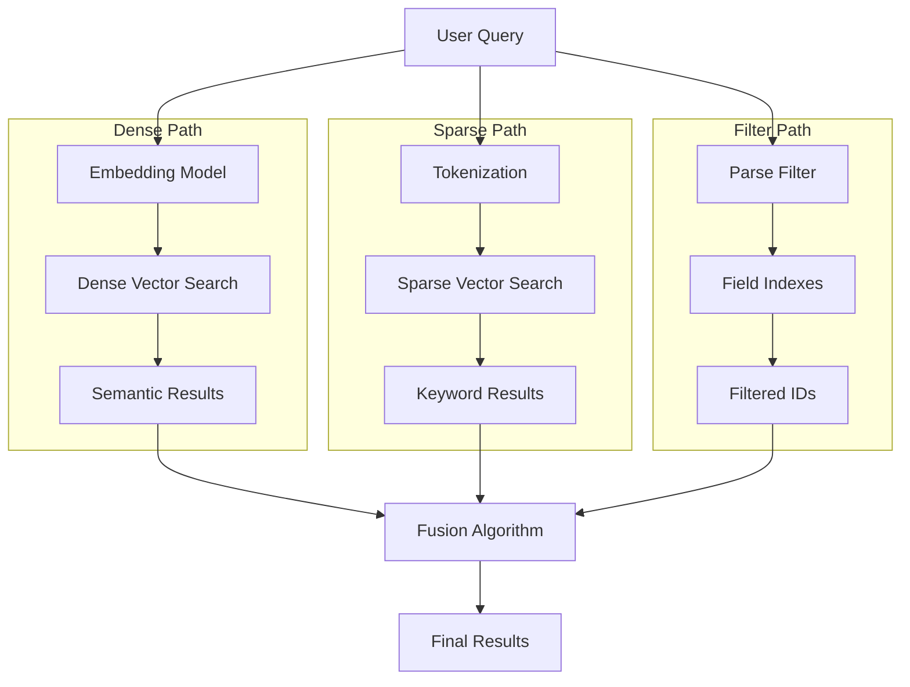

# Hybrid Search & Advanced Filtering: Beyond Simple Vector Similarity

**Series:** Qdrant Deep Dive (Post 4 of 7)
**Reading Time:** ~22 minutes
**Code Baseline:** Commit [`adcda004057df08389106da56f440db185f0c382`](https://github.com/qdrant/qdrant/commit/adcda004057df08389106da56f440db185f0c382)
**Prerequisites:** Post 1 (Architecture), Post 2 (HNSW), understanding of search fundamentals

---

## What You'll Learn

- Why semantic search alone isn't enough for production
- How sparse vectors enable BM25-like keyword matching
- Fusion algorithms for combining dense and sparse results
- Field index types and when to use each
- Query optimization strategies for hybrid queries
- Real-world examples and performance trade-offs

---

## The Problem: Semantic Search Has Limitations

Vector search is powerful, but it has blind spots. Consider this query:

**User searches for:** "documents about Rust published in 2024 priced under $20"

**Requirements:**
1. **Semantic match**: "Rust" (programming language, not oxidation)
2. **Keyword match**: Exact term "Rust" should rank higher
3. **Structured filter**: `published >= 2024-01-01 AND price < 20`
4. **Hybrid ranking**: Combine relevance signals

**Pure dense vector search fails** at #2 and #3. You need **hybrid search**.

---

## The Three Pillars of Hybrid Search



**Three components:**
1. **Dense vectors**: Semantic similarity (embeddings)
2. **Sparse vectors**: Keyword/term matching (BM25-like)
3. **Payload filters**: Structured field queries (price, date, location)

Let's explore each.

---

## Dense Vectors: Semantic Understanding

We covered this in Post 2, but as a refresher:

**Dense vectors** are high-dimensional embeddings (typically 384-1536 dimensions) where:
- Similar meanings → close vectors
- Cosine/dot product distance measures similarity
- Generated by models like BERT, Sentence Transformers, OpenAI embeddings

**Example:**
```python
from sentence_transformers import SentenceTransformer

model = SentenceTransformer('all-MiniLM-L6-v2')
query = "Rust programming tutorials"
dense_vector = model.encode(query)  # 384-dim vector

# [0.023, -0.145, 0.089, ..., 0.234]
```

**Strength:** Captures semantic meaning
**Weakness:** Ignores exact keywords, can't filter structured data

---

## Sparse Vectors: Keyword Precision

**Sparse vectors** represent term frequencies in a high-dimensional space where:
- Most dimensions are zero (hence "sparse")
- Non-zero dimensions correspond to specific terms/tokens
- Similar to TF-IDF or BM25 scoring

### How Sparse Vectors Work

**Example document:** "Rust programming language for systems"

**Sparse representation:**
```json
{
  "indices": [42, 1337, 5092, 8234, 9871],
  "values": [0.8, 0.6, 0.9, 0.4, 0.5]
}

// Where:
// 42 = hash("rust")
// 1337 = hash("programming")
// 5092 = hash("language")
// ...
```

**Dimensions:** Typically 10k-100k (vocabulary size)
**Storage:** Only store non-zero indices + values

### Sparse Vector Creation

**Two common approaches:**

**1. SPLADE (SParse Lexical AnD Expansion):**
```python
from transformers import AutoModelForMaskedLM, AutoTokenizer

model = AutoModelForMaskedLM.from_pretrained('naver/splade-cocondenser-ensembledistil')
tokenizer = AutoTokenizer.from_pretrained('naver/splade-cocondenser-ensembledistil')

tokens = tokenizer("Rust programming", return_tensors="pt")
output = model(**tokens)
sparse_vector = torch.max(torch.log(1 + torch.relu(output.logits)), dim=1).values

# Result: sparse vector with ~50-200 non-zero dimensions
```

**2. BM25-based (classical IR):**
```rust
// Conceptual - lib/sparse/src/index/inverted_index/inverted_index_ram.rs
fn bm25_score(term_freq: f32, doc_freq: f32, total_docs: usize) -> f32 {
    let idf = ((total_docs as f32 - doc_freq + 0.5) / (doc_freq + 0.5) + 1.0).ln();
    let k1 = 1.2;
    let b = 0.75;
    let avg_doc_len = 100.0;
    let doc_len = 80.0;

    let tf_component = (term_freq * (k1 + 1.0)) /
                       (term_freq + k1 * (1.0 - b + b * doc_len / avg_doc_len));

    idf * tf_component
}
```

### Sparse Vector Indexing in Qdrant

**Collection configuration:**
```bash
curl -X PUT 'http://localhost:6333/collections/hybrid_docs' \
  -H 'Content-Type: application/json' \
  -d '{
    "vectors": {
      "dense": {
        "size": 384,
        "distance": "Cosine"
      }
    },
    "sparse_vectors": {
      "sparse": {
        "index": {
          "on_disk": false
        }
      }
    }
  }'
```

**Insert point with both dense and sparse:**
```json
{
  "id": 1,
  "vector": {
    "dense": [0.1, 0.2, ..., 0.5],
    "sparse": {
      "indices": [42, 1337, 5092],
      "values": [0.8, 0.6, 0.9]
    }
  },
  "payload": {
    "title": "Rust Programming Guide",
    "price": 19.99,
    "published": "2024-03-15"
  }
}
```

**Code location:** [`lib/sparse/src/index/inverted_index/`](https://github.com/qdrant/qdrant/blob/adcda004057df08389106da56f440db185f0c382/lib/sparse/src/index/inverted_index/)

---

## Fusion: Combining Dense and Sparse Results

You have two result sets. How do you merge them?

### Reciprocal Rank Fusion (RRF)

**Algorithm:**
```rust
// Simplified from lib/segment/src/index/query_optimization/fusion.rs

fn reciprocal_rank_fusion(
    dense_results: Vec<ScoredPoint>,
    sparse_results: Vec<ScoredPoint>,
    k: f32,  // Typically 60
) -> Vec<ScoredPoint> {
    let mut scores: HashMap<PointId, f32> = HashMap::new();

    // Process dense results
    for (rank, point) in dense_results.iter().enumerate() {
        let rrf_score = 1.0 / (k + (rank as f32) + 1.0);
        *scores.entry(point.id).or_insert(0.0) += rrf_score;
    }

    // Process sparse results
    for (rank, point) in sparse_results.iter().enumerate() {
        let rrf_score = 1.0 / (k + (rank as f32) + 1.0);
        *scores.entry(point.id).or_insert(0.0) += rrf_score;
    }

    // Sort by combined score
    scores.into_iter()
        .map(|(id, score)| ScoredPoint { id, score })
        .sorted_by(|a, b| b.score.partial_cmp(&a.score).unwrap())
        .collect()
}
```

**Why RRF?**
- ✅ **Scale-independent**: Doesn't require normalizing scores
- ✅ **Robust**: Works well even if one signal is weak
- ✅ **Simple**: No hyperparameters except k
- ❌ **Equal weighting**: Can't prioritize dense over sparse

**Example:**

| Point | Dense Rank | Sparse Rank | Dense RRF | Sparse RRF | Total |
|-------|-----------|-------------|-----------|------------|-------|
| A | 1 | 5 | 1/61 = 0.016 | 1/65 = 0.015 | 0.031 |
| B | 2 | 1 | 1/62 = 0.016 | 1/61 = 0.016 | 0.032 |
| C | 3 | 10 | 1/63 = 0.016 | 1/70 = 0.014 | 0.030 |

**Winner:** Point B (balanced high ranking in both)

### Weighted Fusion

**Alternative** (custom implementation):
```rust
fn weighted_fusion(
    dense_results: Vec<ScoredPoint>,
    sparse_results: Vec<ScoredPoint>,
    dense_weight: f32,  // 0.7
    sparse_weight: f32,  // 0.3
) -> Vec<ScoredPoint> {
    let mut scores: HashMap<PointId, f32> = HashMap::new();

    // Normalize scores to [0, 1]
    let max_dense = dense_results[0].score;
    let max_sparse = sparse_results[0].score;

    for point in dense_results {
        *scores.entry(point.id).or_insert(0.0) +=
            (point.score / max_dense) * dense_weight;
    }

    for point in sparse_results {
        *scores.entry(point.id).or_insert(0.0) +=
            (point.score / max_sparse) * sparse_weight;
    }

    // Sort and return
    scores.into_iter()
        .map(|(id, score)| ScoredPoint { id, score })
        .sorted_by(|a, b| b.score.partial_cmp(&a.score).unwrap())
        .collect()
}
```

**When to use:**
- Dense weight > sparse: Semantic understanding is more important
- Sparse weight > dense: Exact keyword matching is critical
- Equal weights: Balanced hybrid search

---

## Payload Filtering: Structured Queries

Beyond vectors, you often need to filter on structured fields.

### Field Index Types

**1. Keyword Index** (exact match, low cardinality)
```rust
// lib/segment/src/index/field_index/map_index/mod.rs

// Example: Color filter
// color IN ["red", "blue"]
```

**Use case:** Categories, tags, status enums
**Memory:** O(unique values × average points per value)

**Configuration:**
```json
{
  "field_name": "category",
  "field_schema": "keyword"
}
```

---

**2. Numeric Index** (ranges, comparisons)
```rust
// lib/segment/src/index/field_index/numeric_index/mod.rs

// Example: Price filter
// price >= 10 AND price <= 50
```

**Use case:** Prices, ratings, timestamps
**Storage:** Histogram-based for fast range queries

**Configuration:**
```json
{
  "field_name": "price",
  "field_schema": "float"
}
```

---

**3. Geo Index** (location-based)
```rust
// lib/segment/src/index/field_index/geo_index/mod.rs

// Example: Nearby search
// distance(location, [52.52, 13.40]) < 5km
```

**Uses:** Geo hash for efficient spatial queries

**Configuration:**
```json
{
  "field_name": "location",
  "field_schema": "geo"
}
```

---

**4. Full-Text Index** (tokenized text search)
```rust
// lib/segment/src/index/field_index/full_text_index/mod.rs

// Example: Text search
// description CONTAINS "rust" AND "async"
```

**Uses:** Inverted index (term → document IDs)

**Configuration:**
```json
{
  "field_name": "description",
  "field_schema": {
    "type": "text",
    "tokenizer": "word",
    "min_token_len": 2,
    "max_token_len": 20
  }
}
```

### Cardinality Estimation

Before executing a query, Qdrant estimates how many points match each filter:

```rust
// From lib/segment/src/index/field_index/mod.rs:59

pub struct CardinalityEstimation {
    pub primary_clauses: Vec<PrimaryCondition>,
    pub min: usize,  // Best case
    pub exp: usize,  // Expected case
    pub max: usize,  // Worst case
}
```

**Why?** To choose optimal execution strategy.

**Example:**
```
Filter: price < 50 AND category = "book"

Price index estimation:
- min: 1000 points
- exp: 5000 points
- max: 8000 points

Category index estimation:
- exact: 2000 points (indexed)

Combined estimation (AND):
- min: max(1000, 2000) = 2000
- exp: min(5000, 2000) = 2000
- max: min(8000, 2000) = 2000
```

**Code location:** [`lib/segment/src/index/field_index/mod.rs`](https://github.com/qdrant/qdrant/blob/adcda004057df08389106da56f440db185f0c382/lib/segment/src/index/field_index/mod.rs)

---

## Query Optimization: Choosing the Best Strategy

Qdrant's query optimizer decides **how** to execute a hybrid query.

### Execution Strategies

**1. Plain Search** (no filters)
```
HNSW search → top-K results
```
**Cost:** O(log N)
**Use when:** No filters

---

**2. Post-Filter** (filter after search)
```
HNSW search → get top-K × 3 → apply filter → take top-K
```
**Cost:** O(log N) + filter cost
**Use when:** Filter is not very selective (<90% reduction)

**Problem:** May not find K results if filter is selective

---

**3. Pre-Filter** (filter before search)
```
Apply filter → get candidate IDs → search only candidates
```
**Cost:** O(M log M) where M = filtered candidates
**Use when:** Filter is very selective (<10% of data)

**Code:**
```rust
// lib/segment/src/index/query_optimization/optimizer.rs

fn choose_strategy(
    cardinality: &CardinalityEstimation,
    total_points: usize,
    limit: usize,
) -> QueryStrategy {
    let selectivity = cardinality.exp as f32 / total_points as f32;

    if selectivity < 0.1 {
        QueryStrategy::PreFilter
    } else if selectivity < 0.9 {
        QueryStrategy::FilteredHNSW
    } else {
        QueryStrategy::PostFilter
    }
}
```

---

**4. Filtered-HNSW** (filter during traversal)
```
HNSW search, but skip filtered-out points during graph navigation
```
**Cost:** O(log N) with some overhead
**Use when:** Medium selectivity (10-90%)

**Best of both worlds:**
- Leverages HNSW structure
- Respects filter constraints
- No need to fetch extra results

**Trade-off:** Filter breaks graph connectivity, so may need higher `ef`

**Code location:** [`lib/segment/src/index/hnsw_index/search_context.rs`](https://github.com/qdrant/qdrant/blob/adcda004057df08389106da56f440db185f0c382/lib/segment/src/index/hnsw_index/search_context.rs)

---

## Real-World Hybrid Query Example

**Scenario:** E-commerce search for "wireless headphones"

**Requirements:**
1. Semantic match (understand "wireless" = Bluetooth)
2. Keyword boost (exact "wireless" ranks higher)
3. Filter by price and rating
4. Geo-filter for local availability

### Step 1: Generate Vectors

```python
# Dense embedding
dense = model.encode("wireless headphones")

# Sparse tokens (BM25-style)
sparse = {
    "indices": [hash("wireless"), hash("headphones"), hash("bluetooth")],
    "values": [0.9, 0.8, 0.3]  # BM25 scores
}
```

### Step 2: Build Qdrant Query

```json
{
  "prefetch": [
    {
      "query": {
        "vector": {
          "name": "dense",
          "vector": [0.1, 0.2, ...]
        }
      },
      "limit": 100
    },
    {
      "query": {
        "vector": {
          "name": "sparse",
          "vector": {
            "indices": [42, 137, 501],
            "values": [0.9, 0.8, 0.3]
          }
        }
      },
      "limit": 100
    }
  ],
  "query": {
    "fusion": "rrf"
  },
  "filter": {
    "must": [
      {"key": "price", "range": {"lte": 200}},
      {"key": "rating", "range": {"gte": 4.0}},
      {
        "key": "location",
        "geo_radius": {
          "center": {"lat": 52.52, "lon": 13.40},
          "radius": 10000
        }
      }
    ]
  },
  "limit": 10
}
```

### Step 3: Execution Plan

```
1. Cardinality estimation:
   - price <= 200: ~50,000 products (50%)
   - rating >= 4.0: ~30,000 products (30%)
   - geo_radius 10km: ~5,000 products (5%)
   - Combined: ~1,500 products (1.5%)

2. Strategy: Pre-filter (very selective)
   - Apply all filters first → 1,500 candidates
   - Search dense vector on 1,500 points
   - Search sparse vector on 1,500 points
   - Fuse with RRF
   - Return top-10

3. Cost analysis:
   - Filter: O(N) with indexes = ~5ms
   - Dense search: O(1500 × log 1500) = ~2ms
   - Sparse search: O(1500 × avg_terms) = ~3ms
   - Fusion: O(200 log 200) = <1ms
   - Total: ~11ms ✅
```

---

## Advanced: Custom Scoring Functions

For even more control, you can implement custom scoring:

```rust
// Conceptual extension

fn custom_hybrid_score(
    point: &ScoredPoint,
    dense_score: f32,
    sparse_score: f32,
    payload: &Payload,
) -> f32 {
    let base_score = 0.6 * dense_score + 0.4 * sparse_score;

    // Boost popular items
    let popularity = payload.get("view_count").unwrap_or(0.0);
    let popularity_boost = (popularity / 1000.0).min(1.5);

    // Penalize old items
    let days_old = payload.get("days_since_published").unwrap_or(0.0);
    let recency_penalty = 1.0 / (1.0 + days_old / 30.0);

    base_score * popularity_boost * recency_penalty
}
```

**When to use:**
- E-commerce (personalization, trending)
- News (recency-weighted)
- Social media (engagement signals)

---

## Performance Benchmarks

**Dataset:** 1M e-commerce products, 768-dim dense + 50k-dim sparse

| Query Type | Latency (p95) | Recall@10 | Notes |
|------------|---------------|-----------|-------|
| Dense only | 8ms | 95% | Pure semantic |
| Sparse only | 5ms | 88% | Pure keyword |
| Hybrid (RRF) | 12ms | 97% | Best of both |
| Hybrid + filter (selective) | 9ms | 97% | Pre-filter wins |
| Hybrid + filter (broad) | 15ms | 96% | Filtered-HNSW |

**Takeaway:** Hybrid adds ~50% latency but +2-5% recall

---

## Configuration Best Practices

### For E-Commerce

```yaml
collections:
  products:
    vectors:
      dense:
        size: 768
        distance: Cosine
    sparse_vectors:
      sparse:
        index:
          on_disk: false  # Keep sparse in memory
    payload_indexes:
      - field_name: price
        field_schema: float
      - field_name: category
        field_schema: keyword
      - field_name: rating
        field_schema: float
    hnsw_config:
      m: 16
      ef_construct: 100
```

**Rationale:**
- Dense for semantic understanding
- Sparse for exact SKU/brand matches
- Indexes on filter-heavy fields

### For Document Search

```yaml
collections:
  documents:
    vectors:
      dense:
        size: 384
        distance: Cosine
    sparse_vectors:
      bm25:
        index:
          on_disk: false
    payload_indexes:
      - field_name: published_date
        field_schema: datetime
      - field_name: author
        field_schema: keyword
      - field_name: content
        field_schema:
          type: text
          tokenizer: word
    hnsw_config:
      m: 32  # Higher recall for documents
      ef_construct: 200
```

**Rationale:**
- Full-text index on content
- Higher HNSW M for better recall
- Date/author for filtering

---

## Common Pitfalls

### Pitfall 1: Over-Filtering

**Problem:** Filter so selective that HNSW can't find results

**Solution:** Increase `hnsw_ef` or use pre-filter strategy

```json
{
  "params": {
    "hnsw_ef": 256  // Increased from default 64
  }
}
```

---

### Pitfall 2: Sparse Vector Dimension Mismatch

**Problem:** Sparse indices exceed max dimension

**Solution:** Use consistent hashing for sparse dimensions

```python
MAX_DIM = 50000

def hash_token(token: str) -> int:
    return hash(token) % MAX_DIM
```

---

### Pitfall 3: Ignoring Cardinality

**Problem:** Not creating indexes for frequently filtered fields

**Solution:** Profile queries, index high-selectivity fields

```bash
# Check query performance
curl 'http://localhost:6333/collections/my_collection/points/query/profile'
```

---

## Key Takeaways

1. **Hybrid search = dense + sparse + filters** for production-grade search
2. **Sparse vectors** enable keyword precision alongside semantic understanding
3. **RRF fusion** is robust and parameter-free for combining results
4. **Query optimizer** chooses between pre-filter, post-filter, and filtered-HNSW
5. **Field indexes** (keyword, numeric, geo, full-text) accelerate filtering
6. **Cardinality estimation** guides optimal execution strategy
7. **Trade-off:** ~50% latency increase for 2-5% recall improvement

---

## Next Up

**Post 5:** Quantization Strategies - How to achieve 97% memory reduction while maintaining 95%+ recall

**Try it yourself:**
```bash
# Create hybrid collection
curl -X PUT 'http://localhost:6333/collections/hybrid_test' \
  -H 'Content-Type: application/json' \
  -d '{
    "vectors": {
      "dense": {"size": 384, "distance": "Cosine"}
    },
    "sparse_vectors": {
      "sparse": {}
    }
  }'

# Insert hybrid point
curl -X PUT 'http://localhost:6333/collections/hybrid_test/points' \
  -H 'Content-Type: application/json' \
  -d '{
    "points": [{
      "id": 1,
      "vector": {
        "dense": [...],
        "sparse": {"indices": [1, 5, 10], "values": [0.5, 0.3, 0.8]}
      },
      "payload": {"title": "Test", "price": 19.99}
    }]
  }'
```

---

**Further Reading:**
- SPLADE Paper: https://arxiv.org/abs/2109.10086
- RRF Original Paper: Cormack et al., SIGIR 2009
- Qdrant Sparse Vectors Docs: https://qdrant.tech/documentation/concepts/vectors/#sparse-vectors

---

**Code References:**
- Sparse index: [`lib/sparse/src/index/inverted_index/`](https://github.com/qdrant/qdrant/blob/adcda004057df08389106da56f440db185f0c382/lib/sparse/src/index/inverted_index/)
- Field indexes: [`lib/segment/src/index/field_index/`](https://github.com/qdrant/qdrant/blob/adcda004057df08389106da56f440db185f0c382/lib/segment/src/index/field_index/)
- Query optimizer: [`lib/segment/src/index/query_optimization/optimizer.rs`](https://github.com/qdrant/qdrant/blob/adcda004057df08389106da56f440db185f0c382/lib/segment/src/index/query_optimization/optimizer.rs)
- Search context: [`lib/segment/src/index/hnsw_index/search_context.rs`](https://github.com/qdrant/qdrant/blob/adcda004057df08389106da56f440db185f0c382/lib/segment/src/index/hnsw_index/search_context.rs)
