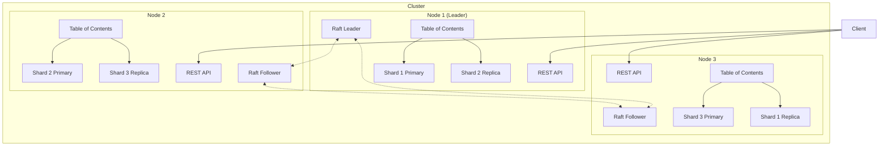

# Distributed Qdrant: Raft Consensus, Sharding, and Replication

**Series:** Qdrant Deep Dive (Post 6 of 7)
**Reading Time:** ~22 minutes
**Code Baseline:** Commit [`adcda004057df08389106da56f440db185f0c382`](https://github.com/qdrant/qdrant/commit/adcda004057df08389106da56f440db185f0c382)
**Prerequisites:** Post 1 (Architecture), understanding of distributed systems basics

---

## What You'll Learn

- Why distributed vector databases are hard
- How Raft consensus ensures consistency
- Sharding strategies and hash ring distribution
- Replication for high availability
- Failure scenarios and recovery mechanisms
- Configuring production clusters
- Performance implications of distribution

---

## The Need for Distribution

**Single-node limitations:**
- **Memory:** Can't fit 100M+ vectors on one machine
- **Throughput:** Limited by single CPU for queries
- **Availability:** Node failure = total downtime
- **Latency:** No geographic distribution

**Distributed solution:**
- **Sharding:** Split data across nodes (horizontal scaling)
- **Replication:** Copy data for redundancy
- **Consensus:** Coordinate state across cluster
- **Load balancing:** Distribute queries

---

## Architecture: Distributed Qdrant



**Key components:**
1. **Raft Consensus:** Coordinates cluster state
2. **Shards:** Data partitions (primary + replicas)
3. **API Nodes:** Any node can serve requests
4. **Internal RPC:** gRPC for inter-node communication

---

## Raft Consensus: Coordinating the Cluster

### What is Raft?

**Raft** is a consensus algorithm that ensures all nodes agree on cluster state.

**Key guarantees:**
- **Leader election:** One node is the leader at any time
- **Log replication:** Leader's log is replicated to followers
- **Safety:** Committed entries never lost

**Why Raft?**
- ✅ **Understandable:** Simpler than Paxos
- ✅ **Proven:** Used in etcd, Consul, TiKV
- ✅ **Partition-tolerant:** Handles network splits
- ❌ **CP not AP:** Chooses consistency over availability (CAP theorem)

### Raft State Machine

**Cluster metadata managed by Raft:**
- Collection configurations
- Shard assignments (which node hosts which shard)
- Replication factor
- Node membership

**NOT managed by Raft:**
- Individual points (too high volume)
- Queries (read-only, no consensus needed)

### Leader Election

```rust
// Conceptual from src/consensus.rs:46

enum NodeState {
    Follower,    // Normal state, follows leader
    Candidate,   // Competing to become leader
    Leader,      // Coordinates cluster
}

fn start_election(&mut self) {
    self.state = NodeState::Candidate;
    self.term += 1;
    self.voted_for = Some(self.id);

    // Request votes from all peers
    for peer in &self.peers {
        send_vote_request(peer, self.term, self.last_log_index);
    }
}

fn handle_vote_request(&mut self, candidate: PeerId, term: u64) -> bool {
    if term > self.term && self.voted_for.is_none() {
        self.voted_for = Some(candidate);
        return true;  // Grant vote
    }
    false  // Deny vote
}
```

**Timeline:**
```
t=0:  Node 1 (Follower)  Node 2 (Follower)  Node 3 (Follower)
      [Heartbeat timeout]

t=1:  Node 1 → Candidate (term 2)
      Sends vote requests

t=2:  Node 2 → Votes for Node 1
      Node 3 → Votes for Node 1

t=3:  Node 1 → Leader (term 2)
      Majority achieved (2/3 votes)
```

**Election timeout:** 150-300ms (randomized to prevent split votes)

**Code location:** [`src/consensus.rs:46`](https://github.com/qdrant/qdrant/blob/adcda004057df08389106da56f440db185f0c382/src/consensus.rs#L46)

---

### Log Replication

**When a client creates a collection:**

```
Client → Node 1 (Leader):
  POST /collections/products
  {vectors: {size: 768, distance: "Cosine"}}

Leader's Raft log:
  Entry 42: CreateCollection("products", config)

Leader → Followers:
  AppendEntries(entry 42)

Follower acknowledgment:
  Node 2 → ACK
  Node 3 → ACK

Leader:
  Entry 42 committed (majority ACK)
  Apply to state machine (create collection)
  Respond to client: 200 OK
```

**Linearizability:** Client doesn't see success until majority committed.

### Handling Network Partitions

**Scenario:** 3-node cluster, network partition splits nodes.

```
Partition: [Node 1, Node 2] | [Node 3]

Node 1 & 2:
  - Form majority quorum (2/3)
  - Node 1 remains leader
  - Accepts writes ✅

Node 3:
  - Cannot form quorum (1/3)
  - Cannot elect new leader
  - Rejects writes ❌ (no leader)
```

**When partition heals:**
```
Node 3 rejoins:
  - Receives missing log entries from leader
  - Catches up to current state
  - Resumes as follower
```

**Safety:** Minority partition cannot make progress (prevents split-brain).

---

## Sharding: Horizontal Data Partitioning

### Hash Ring Distribution

**Goal:** Distribute points evenly across shards.

**Method:** Consistent hashing on point ID.

```rust
// Simplified from lib/collection/src/collection/mod.rs

fn determine_shard(point_id: PointIdType, num_shards: usize) -> ShardId {
    let hash = hash_point_id(point_id);
    (hash % num_shards as u64) as ShardId
}

fn hash_point_id(point_id: PointIdType) -> u64 {
    match point_id {
        PointIdType::NumId(id) => id,
        PointIdType::Uuid(uuid) => {
            // Hash UUID to u64
            let bytes = uuid.as_bytes();
            u64::from_le_bytes([
                bytes[0], bytes[1], bytes[2], bytes[3],
                bytes[4], bytes[5], bytes[6], bytes[7],
            ])
        }
    }
}
```

**Example (3 shards):**
```
Point ID 100 → hash(100) % 3 = 1 → Shard 1
Point ID 101 → hash(101) % 3 = 2 → Shard 2
Point ID 102 → hash(102) % 3 = 0 → Shard 0
Point ID 103 → hash(103) % 3 = 1 → Shard 1
```

**Properties:**
- ✅ **Even distribution:** Each shard gets ~N/k points
- ✅ **Deterministic:** Same ID always maps to same shard
- ✅ **Fast:** O(1) lookup
- ❌ **Resharding is expensive:** Changing shard count requires data movement

### Shard Types

**1. Local Shard (Primary)**
```rust
// lib/collection/src/shards/local_shard/mod.rs

pub struct LocalShard {
    segments: SegmentHolder,
    update_handler: UpdateHandler,
    wal: WriteAheadLog,
}
```

**Responsibilities:**
- Store segment data
- Execute searches
- Handle writes (via WAL)

---

**2. Remote Shard (Proxy)**
```rust
// lib/collection/src/shards/remote_shard.rs

pub struct RemoteShard {
    peer_id: PeerId,
    shard_id: ShardId,
    channel: Channel,  // gRPC channel to remote node
}

impl RemoteShard {
    async fn search(&self, query: SearchRequest) -> Result<SearchResult> {
        // Forward to remote node
        self.client.search(query).await
    }
}
```

**Responsibilities:**
- Proxy requests to remote node
- Load balancing
- Failover to replica on error

---

**3. Replica Shard**

Same as Local Shard, but receives replicated writes.

**Replication flow:**
```
Client → Node 1 (Shard 1 Primary):
  Insert point 100

Node 1:
  1. Write to local WAL
  2. Apply to segments
  3. Async replicate to Node 3 (Shard 1 Replica)

Node 3:
  1. Receive replication message
  2. Write to local WAL
  3. Apply to segments
  4. ACK to Node 1
```

**Consistency:** Eventually consistent (async replication).

**Code location:** [`lib/collection/src/shards/`](https://github.com/qdrant/qdrant/blob/adcda004057df08389106da56f440db185f0c382/lib/collection/src/shards/)

---

## Replication: High Availability

### Replication Factor

**Configuration:**
```yaml
storage:
  replication_factor: 2  # Each shard has 2 copies
```

**Example (3 nodes, 3 shards, RF=2):**
```
Node 1: [Shard 0 Primary, Shard 2 Replica]
Node 2: [Shard 1 Primary, Shard 0 Replica]
Node 3: [Shard 2 Primary, Shard 1 Replica]
```

**Benefit:** Lose 1 node, all data still available.

### Write Consistency Factor

**Configuration:**
```yaml
storage:
  write_consistency_factor: 2  # Wait for 2 replicas before ACK
```

**Write flow (WCF=2):**
```
Client → Node 1 (Shard 0 Primary):
  Insert point

Node 1:
  1. Write locally ✅
  2. Send to Node 2 (Replica) → ACK ✅
  3. Two ACKs received (Primary + 1 Replica)
  4. Respond to client: 200 OK
```

**Trade-off:**
- **WCF = 1** (default): Fastest writes, risk of data loss if node crashes
- **WCF = 2**: Safer, 2x latency for writes
- **WCF = RF**: Slowest, strongest durability

---

### Read Strategy

**By default:** Query only primary shards (consistency).

**For higher throughput:**
```json
{
  "shard_selection": "best_effort"
}
```

**Behavior:** Query replicas if primary is slow or unavailable.

**Trade-off:** May see stale data (eventual consistency).

---

## Failure Scenarios and Recovery

### Scenario 1: Node Failure (Transient)

**Setup:** 3 nodes, RF=2

**Failure:** Node 2 crashes (power outage)

**Impact:**
- Shard 1 Primary (Node 2) → unavailable
- Shard 1 Replica (Node 3) → promoted to primary ✅
- Queries continue with minimal disruption

**Timeline:**
```
t=0:  Node 2 crashes
t=1:  Health check fails (5s timeout)
t=2:  Raft detects failure
t=3:  Node 3's Shard 1 Replica promoted to primary
t=4:  Clients redirected to Node 3
      Total downtime: ~6-10s
```

**Recovery:**
```
Node 2 restarts (t=60):
  1. Rejoins Raft cluster
  2. Receives missing log entries
  3. Syncs Shard 1 data from Node 3
  4. Becomes replica again
```

---

### Scenario 2: Network Partition

**Setup:** 3 nodes, RF=2

**Partition:** `[Node 1, Node 2] | [Node 3]`

**Raft quorum:**
- Majority partition (Nodes 1, 2): ✅ Can elect leader, accept writes
- Minority partition (Node 3): ❌ Cannot elect leader, read-only

**Data availability:**
- Shards on Nodes 1, 2: Fully available
- Shards only on Node 3: Unavailable until partition heals

**Resolution:** Partition heals, Node 3 syncs, cluster recovers.

---

### Scenario 3: Permanent Node Loss

**Setup:** 3 nodes, RF=2

**Failure:** Node 3 disk failure (unrecoverable)

**Response:**
1. Remove Node 3 from cluster (admin action):
   ```bash
   curl -X DELETE 'http://localhost:6333/cluster/peer/3'
   ```

2. Raft updates cluster state (now 2 nodes)

3. Re-replicate shards previously on Node 3:
   - Shard 2 Replica (was on Node 3) → create new replica on Node 1
   - Shard 1 Replica (was on Node 3) → create new replica on Node 2

4. Cluster returns to RF=2

**Automatic rebalancing:** (Future RFC-0008 feature)

---

### Scenario 4: Split-Brain Prevention

**Scenario:** 5-node cluster splits into [2 nodes] | [3 nodes]

**Raft behavior:**
- Partition with 3 nodes: Majority (3/5) → remains operational ✅
- Partition with 2 nodes: Minority (2/5) → cannot elect leader ❌

**Why quorum matters:**
```
If both partitions could elect leaders:
  - Client A → Partition 1 Leader → Write X
  - Client B → Partition 2 Leader → Write Y
  - Partition heals → Conflicting state! (split-brain)

Raft prevents this:
  - Only partition with majority can write
  - Consistency guaranteed
```

---

## Configuration: Production Clusters

### Small Cluster (3 nodes)

```yaml
cluster:
  enabled: true
  p2p:
    port: 6335

  consensus:
    tick_period_ms: 100
    bootstrap_timeout_sec: 5

storage:
  replication_factor: 2
  write_consistency_factor: 1  # Fast writes
  shard_number: 6  # 2 shards per node on average
```

**Rationale:**
- 3 nodes: Tolerate 1 node failure
- RF=2: Each shard has 1 backup
- WCF=1: Prioritize latency
- 6 shards: Load balanced across nodes

---

### Large Cluster (10+ nodes)

```yaml
cluster:
  enabled: true
  p2p:
    port: 6335
    connection_pool_size: 100  # More connections

storage:
  replication_factor: 3  # Higher redundancy
  write_consistency_factor: 2  # Balance durability & latency
  shard_number: 30  # 3 shards per node on average
```

**Rationale:**
- 10+ nodes: Tolerate 2-3 node failures
- RF=3: Can lose 2 replicas and still function
- WCF=2: Strong consistency with acceptable latency
- 30 shards: Even distribution, finer-grained load balancing

---

### Geo-Distributed Cluster

```yaml
cluster:
  enabled: true
  p2p:
    port: 6335

  consensus:
    tick_period_ms: 500  # Slower heartbeat (high latency)
    bootstrap_timeout_sec: 30

storage:
  replication_factor: 3
  write_consistency_factor: 2

  # Place replicas in different regions
  shard_placement:
    - node_ids: [1, 2, 3]  # US-East
    - node_ids: [4, 5, 6]  # EU-West
    - node_ids: [7, 8, 9]  # Asia-Pacific
```

**Challenges:**
- **High latency:** Cross-region network (50-200ms)
- **Raft heartbeats:** Slower tick period to avoid false timeouts
- **Quorum:** Majority must be in same region for low latency

**Use case:** Global read availability, tolerate regional outages.

---

## Performance Implications

### Latency Overhead

**Single node:**
- Insert: ~1ms (write to WAL + segment)

**Distributed (RF=2, WCF=1):**
- Insert: ~2ms (write to local WAL + async replicate)
- Overhead: +1ms

**Distributed (RF=3, WCF=2):**
- Insert: ~5ms (wait for 1 remote replica ACK)
- Overhead: +4ms

**Search:**
- Single node: ~10ms
- Distributed (3 shards, 3 nodes): ~12ms (parallel queries + merge)
- Overhead: +2ms (network + merge)

---

### Throughput Scaling

**Write throughput:**
- Single node: 10k inserts/sec
- 3-node cluster (sharded): 30k inserts/sec (linear scaling ✅)
- Limitation: Raft log replication (metadata writes)

**Read throughput:**
- Single node: 500 queries/sec
- 3-node cluster: 1500 queries/sec (3x, any node can serve)
- Load balancing across all nodes

---

### Network Bandwidth

**Estimate for 10M points/day, 768-dim vectors:**
```
Data: 10M × 768 × 4 bytes = 30 GB/day

Replication (RF=2):
  30 GB × 1 replica = 30 GB/day network transfer

Replication (RF=3):
  30 GB × 2 replicas = 60 GB/day

Hourly: 60 GB / 24 = 2.5 GB/hour = 5.7 Mbps (negligible)
```

**Not a bottleneck** unless very high write rates.

---

## Monitoring and Observability

### Key Metrics

**Raft metrics:**
```
qdrant_raft_term         # Current Raft term
qdrant_raft_state        # Leader, Follower, Candidate
qdrant_raft_log_size     # Raft log entries
qdrant_raft_apply_lag    # Follower lag behind leader
```

**Shard metrics:**
```
qdrant_shard_count             # Total shards
qdrant_shard_replicas_count    # Replicas per shard
qdrant_shard_replication_lag   # Async replication delay
```

**Cluster health:**
```bash
curl 'http://localhost:6333/cluster'
```

**Response:**
```json
{
  "status": "enabled",
  "peer_id": 1,
  "peers": {
    "1": { "uri": "http://node1:6335" },
    "2": { "uri": "http://node2:6335" },
    "3": { "uri": "http://node3:6335" }
  },
  "raft_info": {
    "term": 42,
    "commit": 1337,
    "pending_operations": 0,
    "leader": 1,
    "role": "Leader"
  }
}
```

---

## Operational Best Practices

### 1. Always Use Odd Number of Nodes

**Why?**
- Raft quorum: ⌊N/2⌋ + 1
- 2 nodes: Quorum = 2 (no fault tolerance)
- 3 nodes: Quorum = 2 (tolerate 1 failure) ✅
- 4 nodes: Quorum = 3 (still tolerate only 1 failure, wasteful)
- 5 nodes: Quorum = 3 (tolerate 2 failures) ✅

**Optimal:** 3, 5, or 7 nodes

---

### 2. Set Replication Factor ≥ 2

**RF=1:** No redundancy (single point of failure)
**RF=2:** Tolerate 1 replica loss ✅
**RF=3:** Tolerate 2 replica losses (recommended for production)

---

### 3. Monitor Raft Lag

**If `raft_apply_lag` grows:**
- Follower falling behind
- Possible causes: Network, CPU, disk I/O
- Action: Investigate slow follower, consider removing

---

### 4. Plan for Network Partitions

**Multi-region:**
- Ensure majority of nodes in primary region
- Use higher Raft timeouts (500ms+)

**Single-region:**
- Place nodes in different availability zones
- Monitor cross-zone latency

---

### 5. Backup Strategies

**Snapshots:**
```bash
# Create snapshot on each node
curl -X POST 'http://node1:6333/collections/products/snapshots'
curl -X POST 'http://node2:6333/collections/products/snapshots'
curl -X POST 'http://node3:6333/collections/products/snapshots'
```

**Frequency:** Daily or weekly

**Storage:** S3, GCS, or network filesystem

**Restore:**
```bash
curl -X PUT 'http://localhost:6333/collections/products/snapshots/upload' \
  --data-binary @snapshot.tar
```

---

## Key Takeaways

1. **Raft ensures strong consistency** for cluster metadata
2. **Sharding distributes data** via consistent hashing on point ID
3. **Replication provides redundancy:** RF=2 or 3 for production
4. **Write consistency factor trades latency for durability**
5. **Network partitions handled gracefully:** Quorum prevents split-brain
6. **Monitoring is essential:** Track Raft state, shard health, replication lag
7. **Odd number of nodes** for optimal fault tolerance
8. **Distributed overhead:** +1-5ms latency, but 3x+ throughput

---

## Next Up

**Post 7:** Performance Engineering - SIMD, io_uring, memory management, and low-level optimizations that make Qdrant fast.

**Try it yourself:**
```bash
# Start 3-node cluster locally (Docker Compose)
cat > docker-compose.yml <<EOF
version: '3'
services:
  node1:
    image: qdrant/qdrant
    ports: ["6333:6333", "6335:6335"]
    environment:
      QDRANT__CLUSTER__ENABLED: "true"
      QDRANT__CLUSTER__P2P__PORT: "6335"

  node2:
    image: qdrant/qdrant
    ports: ["6334:6333", "6336:6335"]
    environment:
      QDRANT__CLUSTER__ENABLED: "true"
      QDRANT__CLUSTER__P2P__PORT: "6335"
      QDRANT__CLUSTER__P2P__BOOTSTRAP__URI: "http://node1:6335"

  node3:
    image: qdrant/qdrant
    ports: ["6337:6333", "6338:6335"]
    environment:
      QDRANT__CLUSTER__ENABLED: "true"
      QDRANT__CLUSTER__P2P__PORT: "6335"
      QDRANT__CLUSTER__P2P__BOOTSTRAP__URI: "http://node1:6335"
EOF

docker-compose up
```

---

**Further Reading:**
- Raft Paper: https://raft.github.io/raft.pdf
- Qdrant Cluster Docs: https://qdrant.tech/documentation/guides/distributed_deployment/
- CAP Theorem: Brewer, PODC 2000

---

**Code References:**
- Consensus: [`src/consensus.rs`](https://github.com/qdrant/qdrant/blob/adcda004057df08389106da56f440db185f0c382/src/consensus.rs)
- Sharding: [`lib/collection/src/shards/`](https://github.com/qdrant/qdrant/blob/adcda004057df08389106da56f440db185f0c382/lib/collection/src/shards/)
- Local shard: [`lib/collection/src/shards/local_shard/mod.rs`](https://github.com/qdrant/qdrant/blob/adcda004057df08389106da56f440db185f0c382/lib/collection/src/shards/local_shard/mod.rs)
- Remote shard: [`lib/collection/src/shards/remote_shard.rs`](https://github.com/qdrant/qdrant/blob/adcda004057df08389106da56f440db185f0c382/lib/collection/src/shards/remote_shard.rs)
